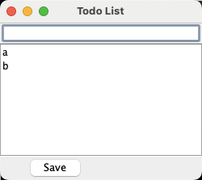

# Lab 4: Team Task: User story exploration and UML class diagrams

---

## Program Overview

This lab is a team-based activity where you'll read a program specification for a todo list application, explore user stories, and develop UML class diagrams to represent the data in the program.

Here is the specification for a todo list application:

A todo list application lets a user create a list of tasks to be completed. Each task has a title, description, due date, and priority level. The user can add, edit, delete, and mark tasks as completed. The application should allow the user to filter tasks to see only the ones not yet completed, and sort the list of tasks by name, due date, or priority. The application should automatically save the list of tasks to persistent storage so that the todo list persists when they quit and reopen the app.

---

## Requirements:
To receive credit for today's team activity, your team must:
- **show your TA a completed UML diagram for the todo list specfication**

---

**To get started, have one member of your team make a fork of this
  repo on GitHub and add each other team member as a collaborator. This
  will allow you to make and review pull requests from each other
  during the lab.**

---

## Part 1: Running the Program

Each team member should clone the repo and run the program. If you have technical problems, please ask your teammates for help or ask a TA if the problem persists.

**Let the TA know when everyone on the team has been able to run the program themselves.** You should see this, although without the a and b:

---

To interact with the program, type a task and then type Enter/Return to add it to the list.

To toggle whether a task is completed, click the task and then press the spacebar.

---

## Part 2: Exploring User Stories

Recall that a user story has this form:

"As a [USER TYPE], I want to [TASK] so that [GOAL]."

Here are a list of user stories. All of them are about a regular user, so we'll prefix all of these with "As a user".

**Which of these user stories are currently supported by the program?**

As a user …

1. I want to categorize my todo items so that I can organize my tasks better
2. I want to remove a todo item so that I can manage my tasks
3. I want to save my todo list so that I can keep my changes when I quit
4. I want to filter my todo list by done or not done items so that I can focus on what needs to be done
5. I want to mark a todo item as done so that I can track my progress
6. I want to view my todo list so that I can choose what to do next
7. I want to set reminders for my todo items so that I can be notified about upcoming tasks
8. I want to add a todo item so that I can keep track of tasks
9. I want to edit a todo item so that I can update task details
10. I want to sort my todo list by priority or due date so that I can prioritize my tasks
11. I want to search for a todo item so that I can quickly find specific tasks
12. I want to set due dates for my todo items so that I can manage my time effectively
13. I want to unmark a todo item as done so that I can revisit tasks
14. When I open the app, I want to see my existing todo list so that I can start working on my tasks

---

## Part 3: The Code

You have identified a set of user stories for the existing program. As you know, every user interface event has a listener method.

* For the user stories you identified, which methods in `csc207.todo_list.TodoListPanel` support those user stories?
* How are tasks stored in this program? What is the Java type used in `TodoListPanel`?
  - To discover this, look at one of the listener methods and trace the code until you find the answer. Do this as a team!
* How are tasks marked as done or not done? What do you think of this choice?
* Divide into 2 subteams. Each of you should take a user story that hasn't yet been implemented and think about what would need to change to implement it.
  - **You don't need to write any code, just discuss, write down your ideas, and discuss within your team.**

---

## Part 4: Toward a Better Design

Right now, the data (the task list and task statuses) are stored directly in class `TodoListPanel`. This makes it hard to write unit tests because the user interface code is jumbled up with the data management code.

Go back to the specification at the top of this file. What is the data that needs to be stored, regardless of how the user interface looks? Do a noun/verb analysis to identify potential classes, and discuss as a team how you would refactor the code to separate the data from the user interface. **You don't need to write any code, just discuss and write down your ideas.**

**Draw a UML class diagram for the classes that your team identifies as necessary to model this todo list domain.**

> **To earn the full marks for this lab, you must show the TA your UML diagram and explain your design.**

---

---
## Bonus

> The rest of this is optional extra practice for your team if you finish everything else in the lab.

## Bonus: Compare to what we did

We've written a command-line version of a todo list program. Clone
https://github.com/paulgries/todo_list_1_class.git and switch to branch `cleaner`.

Run `CommandLineMain.java` and create a few todo items to see the behaviour. Try out all the commands. 

Method `main` has a while loop that does the input handling. It calls helper method `handleCommand` that calls other helper methods depending on what the user typed.

This program uses a `TodoList` to store the data. Go find that class. What are the public methods? Do they correspond to the ones your team discovered for your UML class diagram earlier?

How about the `TodoItem` class? Did you have something similar?

## Bonus: Programming task — save

This code does not save and reload. Split into two subteams. One should work together to write a helper method that saves a `TodoList` to a file, and the other team should figure out how to modify class `CommandLineMain` to add a save option and figure out when the first team's helper method should be called.

Make sure both teams understand _how_ the helper method will be called: write an example of this call. That way you'll figure out what information needs to be gathered from the user.

**Hint:** look at how the GUI version builds a JSON string and saves it.

**Hint:** class `TodoList` should not contain the code that builds the JSON string and writes it to a file. That should be in `CommandLineMain`. 

When both teams are done, merge the code and test it out. Make sure you can save your todo list.

## Bonus: Programming task — load

Read `loadJsonFromFile` from the first repo. You're going to need to do something similar. Update `CommandLineMain` so that it loads the todo list from the save file when the program starts.
